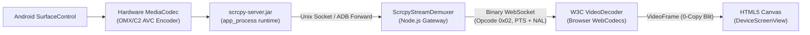
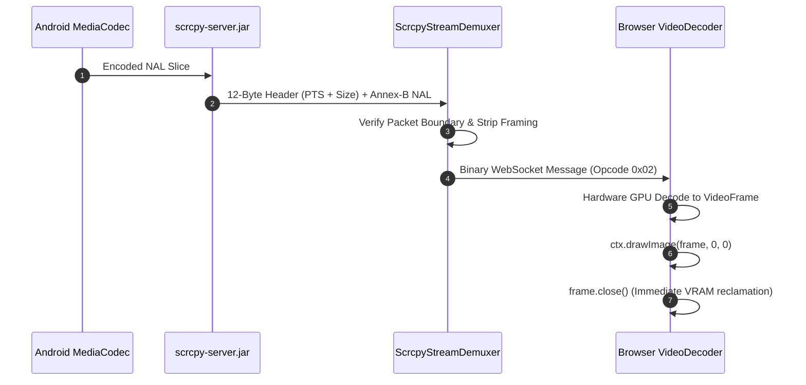

# Video Streaming Pipeline & WebCodecs

This document details the video pipeline that captures Android display frames and renders them on an HTML5 canvas inside the browser with sub-50ms glass-to-glass latency.

---

## High-Level Video Architecture



---

## 1. Device-Side Video Capture (`scrcpy-server.jar`)

### What Is Implemented
Instead of capturing uncompressed screenshots via `screencap` (which consumes high CPU and yields less than 5 FPS), the backend deploys and executes `scrcpy-server.jar` inside Android's internal `app_process` runtime.

### Source File: `backend/src/infrastructure/scrcpy/scrcpy-process.manager.ts`
The `ScrcpyProcessManager` class manages the process lifecycle:
1. Pushes `scrcpy-server.jar` to `/data/local/tmp/scrcpy-server.jar` using ADB if the file is missing or has an outdated checksum.
2. Sets up ADB forward tunnels for video and control sockets:
   ```bash
   adb -s <deviceId> forward tcp:<localPort> localabstract:scrcpy_<sessionId>
   ```
3. Spawns the server binary inside `app_process`:
   ```bash
   adb -s <deviceId> shell CLASSPATH=/data/local/tmp/scrcpy-server.jar \
       app_process / com.genymobile.scrcpy.Server 2.4 \
       tunnel_forward=true \
       video_bit_rate=4000000 \
       max_size=1600 \
       max_fps=60 \
       control=true \
       send_device_meta=true \
       send_frame_meta=true \
       send_dummy_byte=true \
       raw_stream=false
   ```
4. Connects local TCP sockets to the forwarded ADB ports to read video frames and write control packets.

### Architectural Advantage
- Direct access to `android.view.SurfaceControl` and `android.media.MediaCodec`.
- Captures frames directly from the GPU framebuffer and pipes them straight into the hardware H.264 encoder (`c2.android.avc.encoder`), avoiding userland memory copies.

---

## 2. Server-Side Demuxing (`ScrcpyStreamDemuxer`)

### What Is Implemented
The raw stream emitted by `scrcpy-server` consists of an initial device metadata header followed by continuous framed H.264 NAL packets. `ScrcpyStreamDemuxer` parses this binary stream in real time.

### Source File: `backend/src/infrastructure/scrcpy/scrcpy-stream.demuxer.ts`

#### Initial Metadata Header (68 Bytes)
Upon connection, the server transmits:
- **Bytes 0..63 (64 bytes)**: Device model name string (null-padded UTF-8).
- **Bytes 64..67 (4 bytes)**: Codec FourCC identifier (`0x68323634` for H.264 / `h264`).
- **Bytes 68..71 (4 bytes)**: Initial display width (`uint32 BigEndian`).
- **Bytes 72..75 (4 bytes)**: Initial display height (`uint32 BigEndian`).

#### Packet Framing Header (12 Bytes)
Each video packet carries a 12-byte header:
- **Bytes 0..7 (8 bytes)**: Presentation Timestamp (PTS) in microseconds (`uint64 BigEndian`).
  - Bit 63 (`0x8000000000000000n`) indicates a configuration packet containing SPS (Sequence Parameter Set) and PPS (Picture Parameter Set) NALs.
- **Bytes 8..11 (4 bytes)**: Payload length in bytes (`uint32 BigEndian`).
- **Bytes 12..N**: Raw elementary H.264 Annex-B NAL slice (`0x00 0x00 0x00 0x01 ...`).



---

## 3. Client Hardware Decoding (W3C WebCodecs)

### What Is Implemented
Modern web browsers (Chrome 94+, Edge 94+, Brave) provide the W3C **WebCodecs API**, allowing JavaScript to pass H.264 NAL chunks directly into the GPU's hardware decoder pipeline with zero copy overhead.

### Source File: `frontend/web/webcodecs_decoder.js`

```javascript
class WebCodecsStreamPlayer {
    constructor(canvasElement) {
        this.canvas = canvasElement;
        this.ctx = canvasElement.getContext('2d');
        this.decoder = null;
        this.initDecoder();
    }

    initDecoder() {
        this.decoder = new VideoDecoder({
            output: (videoFrame) => {
                // Zero-copy draw directly onto the HTML5 canvas
                this.ctx.drawImage(videoFrame, 0, 0, this.canvas.width, this.canvas.height);
                
                // CRITICAL: Close the VideoFrame immediately to release GPU memory
                videoFrame.close();
            },
            error: (err) => {
                console.error("[WebCodecs] Decoding failure:", err);
            }
        });

        this.decoder.configure({
            codec: 'avc1.42001f', // H.264 Baseline Profile, Level 3.1
            optimizeForLatency: true
        });
    }

    feedChunk(nalBytes, timestampUs, isKeyFrame) {
        const chunk = new EncodedVideoChunk({
            type: isKeyFrame ? 'key' : 'delta',
            timestamp: timestampUs,
            data: nalBytes
        });
        this.decoder.decode(chunk);
    }
}
```

### Critical Reliability Safeguards
1. **Immediate Frame Closure**: Calling `videoFrame.close()` immediately after `drawImage()` is mandatory. In WebCodecs, an unclosed `VideoFrame` holds an active reference in GPU VRAM. Failure to close frames exhausts system VRAM within 30 seconds of 60 FPS streaming, crashing the browser tab.
2. **Keyframe Alignment**: The decoder buffers delta frames until an IDR keyframe with SPS/PPS is processed, preventing visual corruption on initial connection or stream resumption.
