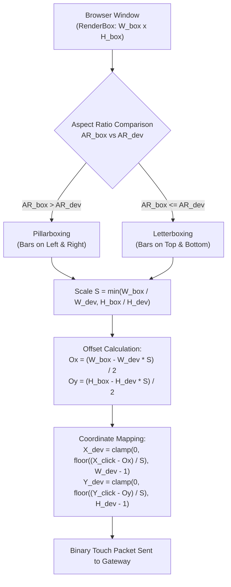

# Input Pipeline & Coordinate Normalization

This document details how client-side user interactions (mouse clicks, drags, mouse wheel scrolling, and physical keyboard strokes) are captured, mathematically transformed, and injected into Android's `InputDispatcher`.

---

## The Challenge of Responsive Browser Viewports

When viewing an Android device in a web browser, the browser window can be resized to arbitrary dimensions: widescreen desktop displays (16:9, 21:9), vertical split screens, or high-DPI displays with device pixel ratio scaling.

An Android device operates on a fixed hardware coordinate system (e.g., $720 \times 1600$). If raw browser mouse coordinates $(X_c, Y_c)$ are forwarded directly to Android without transformation, touch targets miss by hundreds of pixels, making interaction broken.

---

## Mathematical Coordinate Normalization

### Source File: `frontend/lib/presentation/widgets/device_screen_view.dart`

To ensure zero-drift touch mapping across all window dimensions, the viewport applies letterboxing/pillarboxing geometry:



### Exact Formulation:
Let $(W_{\text{dev}}, H_{\text{dev}})$ be the device hardware resolution, and $(W_{\text{box}}, H_{\text{box}})$ be the render box constraints of the canvas widget:

1. **Aspect Ratios**:
   $$AR_{\text{dev}} = \frac{W_{\text{dev}}}{H_{\text{dev}}}, \quad AR_{\text{box}} = \frac{W_{\text{box}}}{H_{\text{box}}}$$

2. **Rendered Display Dimensions**:
   $$\text{If } AR_{\text{box}} > AR_{\text{dev}} \text{ (Pillarboxed)}: \quad H_{\text{disp}} = H_{\text{box}}, \quad W_{\text{disp}} = H_{\text{box}} \cdot AR_{\text{dev}}$$
   $$\text{If } AR_{\text{box}} \le AR_{\text{dev}} \text{ (Letterboxed)}: \quad W_{\text{disp}} = W_{\text{box}}, \quad H_{\text{disp}} = \frac{W_{\text{box}}}{AR_{\text{dev}}}$$

3. **Viewport Offsets**:
   $$O_x = \frac{W_{\text{box}} - W_{\text{disp}}}{2}, \quad O_y = \frac{H_{\text{box}} - H_{\text{disp}}}{2}$$

4. **Normalized Coordinate Transformation**:
   $$X_{\text{dev}} = \operatorname{clamp}\left(0, \; \left\lfloor \frac{X_{\text{click}} - O_x}{S} \right\rfloor, \; W_{\text{dev}} - 1\right)$$
   $$Y_{\text{dev}} = \operatorname{clamp}\left(0, \; \left\lfloor \frac{Y_{\text{click}} - O_y}{S} \right\rfloor, \; H_{\text{dev}} - 1\right)$$
   $$\text{where } S = \frac{W_{\text{disp}}}{W_{\text{dev}}}$$

This guarantees that whether the browser is running on a 4K monitor or a compact laptop window, clicks land on the exact target pixel on the Android screen with 0 pixel drift.

---

## Scrcpy Binary Control Protocol

### Source File: `backend/src/infrastructure/scrcpy/scrcpy-input.adapter.ts`

The Node.js gateway serializes input events into scrcpy's native binary protocol over the control socket:

### 1. Touch Injection Packet (Type 0x02 - 32 Bytes)
```
+------+--------+------------+--------+--------+-------------+--------------+----------+--------------+---------+
| Type | Action | Pointer ID |   X    |   Y    | ScreenWidth | ScreenHeight | Pressure | ActionButton | Buttons |
| 1B   | 1B     | 8B         | 4B     | 4B     | 2B          | 2B           | 2B       | 4B           | 4B      |
+------+--------+------------+--------+--------+-------------+--------------+----------+--------------+---------+
```
- **Type**: `0x02` (`SC_CONTROL_MSG_TYPE_INJECT_TOUCH_EVENT`)
- **Action**: `0` = DOWN, `1` = UP, `2` = MOVE
- **Pointer ID**: `0x0000000000000000n` (64-bit uint for single touch)
- **Coordinates (X, Y)**: 32-bit unsigned integer Big-Endian
- **Screen Dimensions**: 16-bit unsigned integer Big-Endian
- **Pressure**: `0xFFFF` for full contact pressure

### 2. Keycode Injection Packet (Type 0x00 - 14 Bytes)
```
+------+--------+---------+--------+-----------+
| Type | Action | Keycode | Repeat | MetaState |
| 1B   | 1B     | 4B      | 4B     | 4B        |
+------+--------+---------+--------+-----------+
```
- **Type**: `0x00` (`SC_CONTROL_MSG_TYPE_INJECT_KEYCODE`)
- **Action**: `0` = Key Down, `1` = Key Up
- **Keycode**: Android `KeyEvent` integer code (e.g., 66 for `KEYCODE_ENTER`, 67 for `KEYCODE_DEL`)
- **MetaState**: 32-bit bitmask for Shift, Ctrl, Alt, Meta modifiers

### 3. Scroll Injection Packet (Type 0x03 - 21 Bytes)
```
+------+--------+--------+-------------+--------------+---------+---------+---------+
| Type |   X    |   Y    | ScreenWidth | ScreenHeight | hScroll | vScroll | Buttons |
| 1B   | 4B     | 4B     | 2B          | 2B           | 4B      | 4B      | 4B      |
+------+--------+--------+-------------+--------------+---------+---------+---------+
```
- **vScroll**: Signed 32-bit integer representing mouse wheel notches (-1 for scroll down, +1 for scroll up).

---

## Pointer State Machine & Stuck Drag Protection

A notorious bug in web-based remote desktop viewers occurs when a user initiates a drag inside the canvas, moves the mouse cursor outside the browser window, and releases the mouse button. The browser drops the `mouseup` event because it fired outside the canvas DOM element, leaving Android in a permanent "finger held down" state.

### Implementation Solution:
The Flutter frontend attaches global window listeners:
```javascript
window.addEventListener('pointerup', (e) => handleGlobalPointerRelease(e));
window.addEventListener('pointercancel', (e) => handleGlobalPointerRelease(e));
window.addEventListener('blur', () => handleGlobalPointerRelease(null));
```
If the mouse pointer leaves the viewport during an active drag or the window loses focus, the system automatically dispatches a synthetic `ACTION_UP` packet to Android, immediately resetting the pointer state machine.
