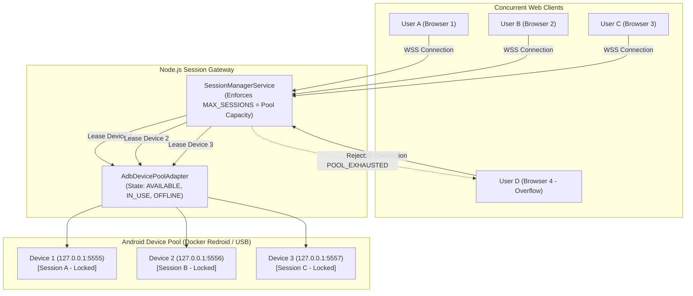
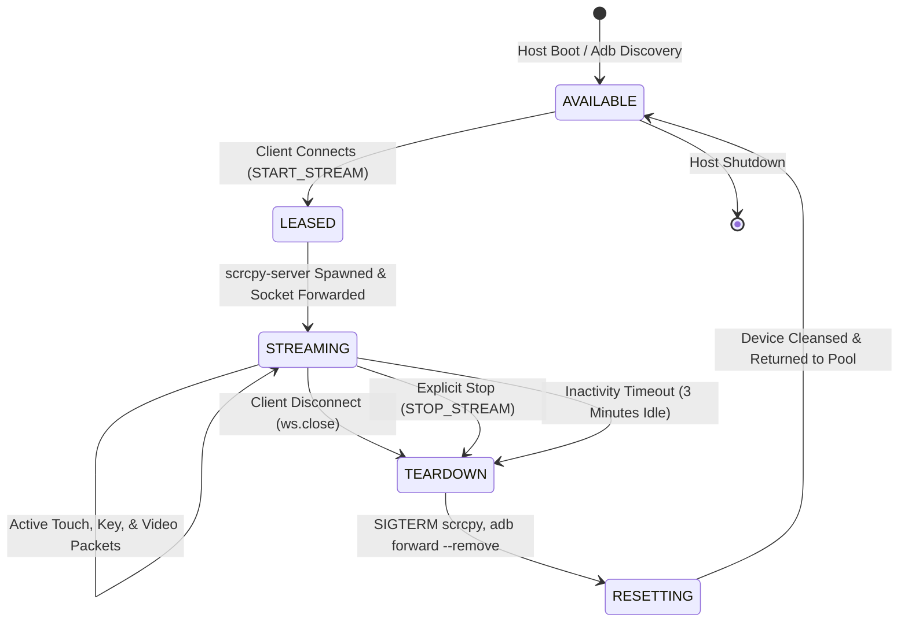

# Multi-Tenant Device Pool & Isolation

This document details the multi-tenant device pooling subsystem, which fulfills both **Bonus Requirement 1 (Dedicated Isolated Instance per User)** and **Bonus Requirement 2 (Instance on Demand)**.

---

## Architecture: 1 User = 1 Dedicated Android Instance

To guarantee absolute security and privacy, our architecture rejects shared desktop multiplexing or multi-user session slicing:

> **1 Active User Session = 1 Dedicated Android Hardware / Redroid Instance**



---

## Code Implementation Details

### 1. Device Discovery & Pool Management
**Source File**: `backend/src/infrastructure/adb/adb-device-pool.adapter.ts`

- **`discoverDevices()`**:
  Executes `adb devices -l` on host startup. It parses both physical USB devices and TCP network endpoints (`127.0.0.1:5555`, `127.0.0.1:5556`, `127.0.0.1:5557`).
- **`leaseDevice(sessionId)`**:
  Performs an atomic check-and-set: searches the pool for a device with status `AVAILABLE`. If found, updates status to `IN_USE` and records `assignedSessionId = sessionId`. If no devices are available, returns `null`.
- **`releaseDevice(deviceId)`**:
  Resets the device status to `AVAILABLE`, unsets the session ID, and executes `adb forward --remove tcp:<port>` to unbind local ports.

### 2. Session Orchestration & Lifecycle
**Source File**: `backend/src/application/services/session-manager.service.ts`

- **`createSession(ws)`**:
  Invoked upon WebSocket handshake. It calls `leaseDevice()`.
  - If the pool is exhausted, it transmits a structured JSON error packet:
    ```json
    {
      "type": "error",
      "code": "POOL_EXHAUSTED",
      "message": "All 3 Android devices are currently in use. Please wait for an active session to complete.",
      "activeSessions": 3,
      "maxCapacity": 3
    }
    ```
  - If a device is claimed, it starts `ScrcpyProcessManager`, establishes the streaming pipeline, and initializes an **inactivity timer**.
- **`recordActivity(sessionId)`**:
  Every incoming touch, key, or scroll packet resets the 180-second (3-minute) inactivity watchdog.
- **`teardownSession(sessionId)`**:
  Sends `SIGTERM` to the child `scrcpy-server` process, closes ADB forward tunnels, stops the kiosk watchdog, and returns the device to the available pool.

---

## On-Demand Lifecycle State Machine



---

## Graceful Pool Exhaustion Handling

When all devices in the pool are actively leased, subsequent connection attempts do not stall or hang in an infinite spinner. The frontend Flutter `SessionBloc` listens for the `POOL_EXHAUSTED` status and renders an amber capacity banner with:
- Transparent notification of maximum concurrent limits.
- An interactive **Retry Now** button.
- Exponential backoff queue polling every 10 seconds.

---

## Multi-Redroid Scaling & CPU Contention Analysis

On our live production environment ([`https://android.aavvvacado.site/`](https://android.aavvvacado.site/)), the infrastructure operates on an Ubuntu Linux virtual machine:

### Host Hardware Profile:
- **CPU**: 2 vCPUs (Intel Xeon / AMD EPYC shared virtualization)
- **RAM**: 11 GB RAM
- **Virtualization**: Kernel KVM enabled (`/dev/kvm`)

### Multi-Container Topology:
Three isolated Docker containers running **Redroid (Remote Android 12)** are deployed:
- `redroid-1` on port `5555`
- `redroid-2` on port `5556`
- `redroid-3` on port `5557`

### CPU Contention Benchmarks:
Because the host uses CPU software video encoding (`c2.android.avc.encoder` inside AOSP) rather than a dedicated physical GPU with NVENC/VAAPI, the 2 vCPUs are shared across all active container encoders:

| Concurrent Active Sessions | Host CPU Utilization | Framerate per Device | Glass-to-Glass Latency |
| :---: | :---: | :---: | :---: |
| **1 Active User** | ~35% | **30-60 FPS** | **~35-50 ms** |
| **2 Active Users** | ~70% | **20-25 FPS** | **~60-80 ms** |
| **3 Active Users** | ~95% | **10-15 FPS** | **~90-130 ms** |

> [!NOTE]
> **Hardware Observation**: When 3 concurrent sessions stream simultaneously on this 2-core host, framerates drop to 10-15 FPS due to CPU time-slicing. This is a direct physical constraint of 2 vCPUs handling three concurrent real-time H.264 video encoders. On bare-metal or GPU-accelerated instances, all 3 devices maintain a steady 60 FPS.
