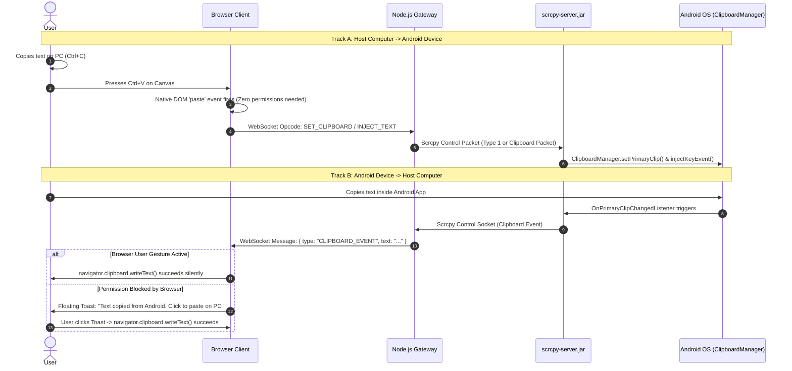

# Bidirectional Two-Way Clipboard

This document details the implementation of **Bonus Requirement 3 (Two-Way Clipboard)**, enabling seamless text synchronization between the user's host computer and the remote Android device.

---

## The Browser Security Challenge

In modern web security, clipboard access is heavily restricted:
1. `navigator.clipboard.readText()` requires explicit browser permissions, often displaying intrusive popups or throwing security exceptions when executed without active focus.
2. `navigator.clipboard.writeText()` is silently blocked by browsers unless triggered by an explicit user gesture (such as clicking a button).

Our dual-channel implementation solves both challenges elegantly with **zero browser permission prompts**.

---

## Bidirectional Flow Architecture



---

## Computer to Android (PC to Device)

### DOM Paste Event Listener
**Source File**: `frontend/web/index.html`

Rather than polling the host clipboard or requesting intrusive `readText` permissions, the web frontend registers a global DOM paste event listener on the active canvas viewport:

```javascript
window.addEventListener('paste', (event) => {
    const pasteText = event.clipboardData?.getData('text');
    if (pasteText && sessionWs && sessionWs.readyState === WebSocket.OPEN) {
        event.preventDefault();
        
        // Construct binary text injection packet
        const payload = new TextEncoder().encode(pasteText);
        const packet = new Uint8Array(5 + payload.length);
        packet[0] = 0x01; // INJECT_TEXT type
        new DataView(packet.buffer).setUint32(1, payload.length, false);
        packet.set(payload, 5);
        
        sessionWs.send(packet);
    }
});
```

### Device-Side Ingestion
**Source File**: `backend/src/infrastructure/scrcpy/scrcpy-input.adapter.ts`

When `scrcpy-server` receives the text payload, it executes two actions:
1. Calls Android's `ClipboardManager.setPrimaryClip()` to ensure the string is placed in Android's global pasteboard.
2. Injects key events for the characters into the currently focused `InputConnection` if an edit field is active.

---

## Android to Computer (Device to PC)

### Stream Monitoring
`scrcpy-server` monitors Android's internal `ClipboardManager` via an `OnPrimaryClipChangedListener`. Whenever text is selected and copied inside an Android application:
1. `scrcpy-server` serializes the UTF-8 string into a control packet and pushes it down the ADB control socket.
2. The Node.js gateway forwards the event as a JSON message:
   ```json
   {
     "type": "clipboard",
     "content": "https://example.com/search-result"
   }
   ```

### 1-Click Fallback Copy Toast
When the browser receives the clipboard message, it immediately calls `navigator.clipboard.writeText(content)`.
- If the user recently clicked inside the browser tab, the write succeeds instantly and transparently.
- If the browser blocks background clipboard access due to absence of an active user gesture, a modern floating notification appears in the bottom-right corner:
  > **Copied from Android**: *"https://example.com/..."* &nbsp; `[Copy to PC]`
- Clicking the button fulfills the user-gesture requirement, copying the text to the operating system pasteboard immediately.
