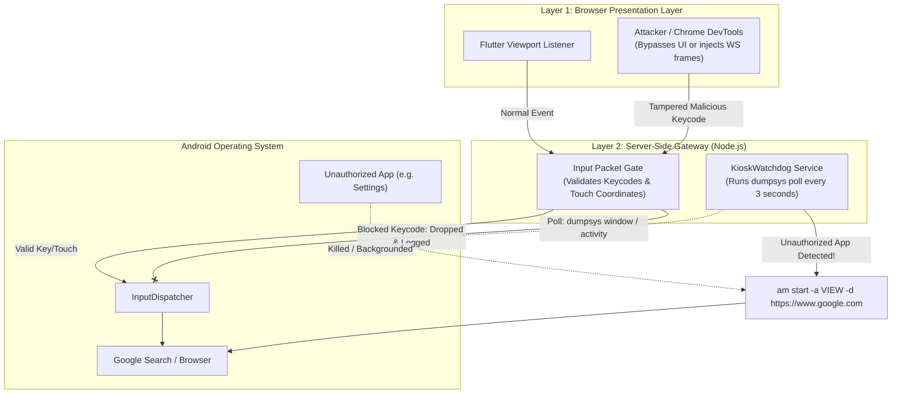

# Kiosk Mode & Security Sandbox

This document details the design and implementation of **Bonus Requirement 4 (Restricted Access / Kiosk Mode)**, which restricts the user session to an approved application and blocks unauthorized system actions.

---

## Chosen Application: Google Search & Web Browser

### Application Identification:
- **Application**: Google Search & Browser
- **Package Names**: `com.android.chrome` (on GMS devices) / `org.chromium.webview_shell` / AOSP Browser (`com.android.browser`)
- **Target URL**: `https://www.google.com`

### Engineering Justification:
1. **Interactive Evaluation Surface**: Google Search provides the ideal testing ground for evaluating streaming performance: rich text input, autocomplete dropdowns, rapid vertical scrolling, multi-media search results, and text selection for clipboard synchronization.
2. **Realistic Security Boundary**: A browser is notoriously difficult to sandbox. Users can attempt to navigate away, open settings, download APK files, or access system dialogs. Successfully locking down a browser demonstrates rigorous defense-in-depth engineering.
3. **Universal Familiarity**: Every evaluator can immediately interact with Google Search without requiring domain-specific training or credentials.

---

## Defined Blocked Actions & Justification Matrix

To ensure the user cannot leave the application or compromise the host system, the following actions are strictly prohibited:

| Prohibited Action | Target Key / Gesture | Justification |
| :--- | :--- | :--- |
| **Home Button** | `KEYCODE_HOME` (3) | Prevents returning to the Android launcher / home screen to launch other installed applications. |
| **App Switcher / Recents** | `KEYCODE_APP_SWITCH` (187) | Prevents viewing background tasks, triggering split-screen mode, or accessing other running apps. |
| **Power Control** | `KEYCODE_POWER` (26) | Prevents locking the screen, powering down the virtual container, or opening the reboot dialog. |
| **Volume Controls** | `KEYCODE_VOLUME_UP` (24)<br>`KEYCODE_VOLUME_DOWN` (25) | Prevents audio adjustments and blocks hardware key combinations that access Android recovery or safe mode. |
| **Notification Shade Gesture** | Downward swipe starting at top edge ($Y < 50\text{ px}$) | Prevents pulling down the Android status bar to access Quick Settings, Wi-Fi toggles, and the Settings gear icon. |
| **System Navigation Gesture** | Upward swipe starting at bottom edge ($Y > H - 50\text{ px}$) | Prevents triggering Android 10+ gesture-navigation home and recent app actions. |
| **System Settings Access** | `com.android.settings` package | Prevents modifying system properties, installing unknown apps, enabling developer options, or resetting network interfaces. |

---

## Dual-Layer Enforcement Architecture

A critical assignment requirement states:
> *"Enforcement must not rely only on the browser, since a user can tamper with client-side code."*

To satisfy this, our platform deploys a **dual-layer defense-in-depth model**:



---

## Layer 1: Client-Side Pre-Filtering
At the presentation level, the Flutter `InputBloc` intercepts keyboard strokes and mouse events:
- Special Android system keys (`F1` for Home, `F2` for Back, `F3` for App Switch) are caught and suppressed if they map to restricted functions.
- Mouse drag gestures initiating within the top 5% or bottom 5% of the viewport are discarded.

---

## Layer 2: Server-Side Packet Gate & Watchdog

Even if a malicious user opens Chrome DevTools and sends raw binary WebSocket frames directly to the backend, the server enforces strict validation before passing data to `scrcpy-server`:

### 1. Server-Side Packet Inspection (`ScrcpyInputAdapter`)
**Source File**: `backend/src/infrastructure/scrcpy/scrcpy-input.adapter.ts`

Every packet received by the Node.js gateway is parsed:
```typescript
// Inspect Keycode Injections
if (packetType === SC_CONTROL_MSG_TYPE_INJECT_KEYCODE) {
    const keycode = buffer.readInt32BE(2);
    const blockedKeycodes = [
        3,   // KEYCODE_HOME
        187, // KEYCODE_APP_SWITCH
        26,  // KEYCODE_POWER
        24,  // KEYCODE_VOLUME_UP
        25,  // KEYCODE_VOLUME_DOWN
        82   // KEYCODE_MENU
    ];
    if (blockedKeycodes.includes(keycode)) {
        logger.warn(`[Kiosk Security] Blocked prohibited keycode ${keycode} from session ${sessionId}`);
        return; // Drop packet immediately
    }
}
```

### 2. Multi-Version `dumpsys` Focus Watchdog
**Source File**: `backend/src/application/services/kiosk-watchdog.service.ts`

If an external intent or popup manages to background the approved browser, a background watchdog runs every 3 seconds. 

Because Android 12 (Redroid) and Android 13/14 format window dumps differently, the watchdog inspects multiple fields:
```bash
adb shell "dumpsys window | grep -E 'mCurrentFocus|mFocusedApp|mResumedActivity'"
```

If the focused window belongs to an unapproved package (such as `com.android.settings` or `com.android.launcher3`), the watchdog automatically triggers an immediate recovery:
```bash
adb shell am start -a android.intent.action.VIEW -d "https://www.google.com"
```
The user is instantly returned to the Google Search sandbox, rendering escape attempts impossible.
