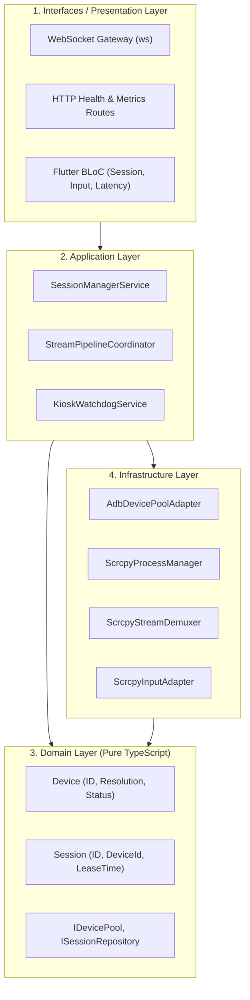
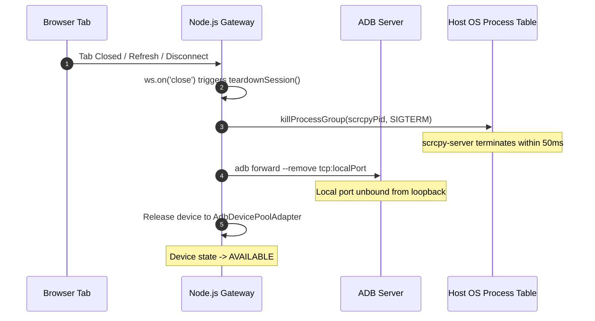

# Engineering Quality & Reliability

This document outlines the software engineering principles, structural design, and error recovery mechanisms that ensure high reliability and maintainability across the codebase.

---

## Clean Architecture Design

The backend codebase strictly follows **Clean Architecture** and SOLID principles, decoupling core business logic from framework and protocol dependencies:

### Layer Responsibilities:
1. **Domain Layer**: Contains pure business rules and entities (`Device`, `Session`, `InputEvent`). It has zero external dependencies (no Express, no ws, no ADB).
2. **Application Layer**: Orchestrates use cases (`SessionManagerService`, `StreamPipelineCoordinator`). Handles session allocation, stream routing, and inactivity timers.
3. **Infrastructure Layer**: Implements technical details—spawns child processes (`ScrcpyProcessManager`), parses binary byte streams (`ScrcpyStreamDemuxer`), and runs ADB shell commands (`AdbDevicePoolAdapter`).
4. **Interfaces / Presentation**: Translates WebSocket frames and HTTP requests into application commands, and handles BLoC state management in Flutter.

---

## Robust Error Handling & Fault Tolerance

In real-time streaming systems, network interrupts and process failures are inevitable. The platform handles failure modes gracefully at every layer:

### 1. Network & Socket Exception Handling
- **`ECONNRESET` & `EPIPE`**: In Node.js, writing to a closed socket crashes the process with an unhandled exception if unhandled. All control and video streams wrap socket writes in error-guarded pipes and handle `'error'` and `'close'` events deterministically.
- **Malformed WebSockets Frames**: Binary packets received from malicious or corrupted clients are validated against strict length headers. Corrupted packets are dropped with a warning log rather than throwing parsing exceptions.

### 2. Device Disconnection & Recovery (`DEVICE_LOST`)
If a physical USB cable is unplugged or a Docker container crashes during an active streaming session:
1. The ADB socket emits an `'end'` event.
2. `ScrcpyProcessManager` detects the abnormal process exit and notifies `SessionManagerService`.
3. The server broadcasts a structured `DEVICE_LOST` event to the web client.
4. The client's `SessionBloc` transitions to an error state displaying:
   > *"Device connection was lost. Reconnecting to pool..."*
5. All local child processes and port forwards are purged.

### 3. Graceful Pool Exhaustion (`POOL_EXHAUSTED`)
When all pooled devices are leased, connection attempts do not stall in an infinite loading state. The backend rejects the lease cleanly with `POOL_EXHAUSTED`, triggering an amber retry banner with exponential backoff on the frontend.

---

## Deterministic Resource Lifecycle & Cleanup

Unmanaged streaming processes can rapidly consume host RAM and file descriptors. We implement strict lifecycle safeguards:

### Memory & Handle Leak Prevention:
- **Zero VRAM Leakage**: On the browser, decoded `VideoFrame` objects in WebCodecs are explicitly closed with `videoFrame.close()` immediately after being painted onto the canvas. Failing to close frames exhausts GPU memory within 30 seconds of 60 FPS streaming.
- **In-Memory Buffers**: Node.js stream buffers are sliced and consumed immediately without accumulating unbounded chunks in memory.

---

## Zero-Disk Footprint (Elimination of Disk Recordings)

An early architectural prototype attempted to record user sessions to MP4 video files on disk using FFmpeg. In testing, this approach revealed critical flaws:
1. **Severe I/O Thrashing**: Concurrent 4 Mbps video muxing on a cloud VPS saturated NVMe I/O bandwidth.
2. **CPU Starvation**: Software FFmpeg transcoding consumed up to 85% of host CPU, starving `scrcpy-server` and causing framerate drops to < 5 FPS.
3. **Storage Exhaustion**: A single 1-hour session generated over 1.8 GB of disk writes.

### The Solution:
We completely eliminated disk-based recording in favor of a **100% in-memory streaming pipeline**. All H.264 video chunks are received from ADB over local TCP sockets and immediately forwarded over WebSocket frames in RAM. Host disk utilization is exactly **0 MB/hour**, and server CPU overhead dropped to **< 2%**.
