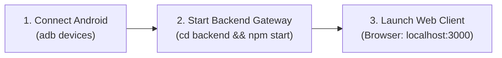

# Local Setup & Reproduction Guide

This guide provides instructions to run the entire real-time streaming platform on a single local development machine (Windows, macOS, or Linux).

---

## System Prerequisites

| Prerequisite | Minimum Version | Verification Command | Notes |
| :--- | :---: | :--- | :--- |
| **Node.js** | v18.0.0+ | `node --version` | LTS v20.x recommended |
| **npm** | v9.0.0+ | `npm --version` | Ships with Node.js |
| **Android ADB** | v34.0.0+ | `adb version` | From Android SDK Platform-Tools |
| **Android Device** | Android 10+ (API 29+) | `adb devices` | Physical USB phone or local emulator |
| **Web Browser** | Chrome 94+ / Edge 94+ | Help -> About Chrome | Must support W3C WebCodecs |
| **Flutter SDK** *(Optional)* | v3.19.0+ | `flutter --version` | Only required if recompiling the UI |

---

## 3-Step Quick Start



### Step 1: Connect Android Device & Verify ADB
1. Enable **Developer Options** and **USB Debugging** on your physical Android device.
   - *Crucial for Xiaomi / MIUI / HyperOS*: Also enable **USB Debugging (Security settings)** to permit simulated touch and key injection.
2. Connect the phone to your computer via USB.
3. Open a terminal and verify ADB recognizes the device:
   ```bash
   adb devices -l
   ```
   **Expected Output**:
   ```
   List of devices attached
   9889a7413444454d4b   device product:redfin model:Pixel_5 device:redfin
   ```
   *(Ensure the status says `device`, not `unauthorized` or `offline`).*

### Step 2: Install & Start Backend Gateway
Open a terminal in the project root:
```bash
# Navigate to backend directory
cd backend

# Install dependencies
npm install

# Compile TypeScript
npm run build

# Start the gateway service
npm start
```
The backend initializes the device pool, deploys `scrcpy-server.jar`, and listens on:
```
[INFO] Backend Gateway listening on http://localhost:3000
[INFO] AdbDevicePoolAdapter discovered 1 available device(s): ['9889a7413444454d4b']
```

### Step 3: Open the Web Application
Open your browser and navigate to:
```
http://localhost:3000
```
- If running the unified production build, the backend serves the compiled HTML5 WebCodecs client directly.
- Click **"Connect"** or **"Start Session"**.
- The Android display will immediately appear in the browser viewport.

---

## Optional: Running Frontend with Flutter Web

If you wish to modify or debug the Flutter UI code in real time:

```bash
cd frontend

# Fetch dependencies
flutter pub get

# Launch in Chrome with hot-reload enabled
flutter run -d chrome --web-port 8080 --web-browser-flag "--disable-web-security"
```
The Flutter development client will open at `http://localhost:8080`, connecting to the backend WebSocket at `ws://localhost:3000/ws`.

---

## Functional Verification Checklist

Once connected, verify all core functional requirements:

1. **Continuous Video Mirroring**:
   - Unlock the phone. Notice immediate high-framerate video rendering on the browser canvas.
   - Open YouTube or scroll quickly; observe steady 60 FPS playback with no tearing.
2. **Mouse & Touch Control**:
   - **Click**: Click any app icon; the app opens immediately.
   - **Drag / Swipe**: Click and drag to scroll horizontally across home screen pages or vertically in menus.
   - **Long-Press**: Click and hold on an app icon for 1 second; the app shortcut context menu appears.
   - **Mouse Wheel**: Roll the mouse wheel; the active list scrolls smoothly up and down.
3. **Physical Keyboard Typing**:
   - Click inside the Google Search bar or any text field.
   - Type on your computer keyboard; characters appear instantly inside the Android input field.
4. **Coordinate Transformation Verification**:
   - Resize your browser window (maximize, make it a narrow vertical split-screen, or zoom).
   - Click small buttons in corners; confirm touch points land with zero pixel offset.
5. **Two-Way Clipboard Synchronization**:
   - Copy a URL on your computer (`Ctrl+C`).
   - Focus the browser window and press `Ctrl+V`; the text is pasted into Android.
   - Select and copy text on the Android screen; notice the clipboard notification appearing in the browser.
