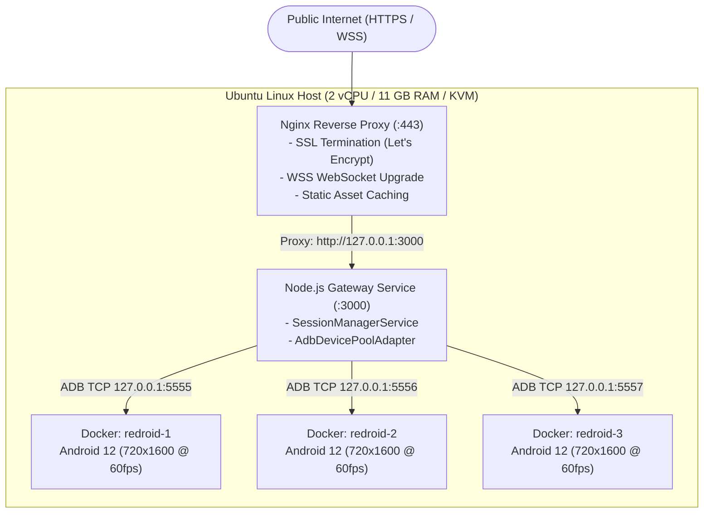

# Cloud Deployment & Docker Pooling

This document details the production cloud deployment hosting [`https://android.aavvvacado.site/`](https://android.aavvvacado.site/), including our multi-container Redroid infrastructure and Nginx reverse proxy configuration.

---

## Production Infrastructure Overview

The production system runs on an Ubuntu Linux virtual machine equipped with KVM hardware virtualization:



---

## Containerized Android (Redroid / Re-KVM)

To support multiple simultaneous users without requiring a physical rack of USB-attached smartphones, the deployment leverages **Redroid** (Remote Android in Docker), an open-source AOSP container solution:

### 1. Host Kernel Prerequisites
Redroid requires Linux kernel binder and ashmem modules:
```bash
# Load binder and ashmem modules
sudo modprobe binder_linux devices="binder,hwbinder,vndbinder"
sudo modprobe ashmem_linux

# Verify KVM acceleration access
ls -la /dev/kvm
# Ensure permission: crw-rw----+ 1 root kvm
```

### 2. Multi-Instance Docker Compose Configuration
The 3 isolated Android containers are orchestrated via `docker-compose.yml`:

```yaml
version: '3.8'

services:
  redroid-1:
    image: redroid/redroid:12.0.0-latest
    privileged: true
    ports:
      - "5555:5555"
    volumes:
      - redroid1_data:/data
    command:
      - "androidboot.redroid_width=720"
      - "androidboot.redroid_height=1600"
      - "androidboot.redroid_fps=60"
      - "androidboot.redroid_dpi=320"
      - "androidboot.redroid_gpu_mode=guest"

  redroid-2:
    image: redroid/redroid:12.0.0-latest
    privileged: true
    ports:
      - "5556:5555"
    volumes:
      - redroid2_data:/data
    command:
      - "androidboot.redroid_width=720"
      - "androidboot.redroid_height=1600"
      - "androidboot.redroid_fps=60"
      - "androidboot.redroid_dpi=320"
      - "androidboot.redroid_gpu_mode=guest"

  redroid-3:
    image: redroid/redroid:12.0.0-latest
    privileged: true
    ports:
      - "5557:5555"
    volumes:
      - redroid3_data:/data
    command:
      - "androidboot.redroid_width=720"
      - "androidboot.redroid_height=1600"
      - "androidboot.redroid_fps=60"
      - "androidboot.redroid_dpi=320"
      - "androidboot.redroid_gpu_mode=guest"

volumes:
  redroid1_data:
  redroid2_data:
  redroid3_data:
```

### 3. Automatic ADB Connect Script
When the host boots, an initialization script connects the ADB daemon to the container ports:
```bash
adb connect 127.0.0.1:5555
adb connect 127.0.0.1:5556
adb connect 127.0.0.1:5557

# adb devices output:
# 127.0.0.1:5555    device
# 127.0.0.1:5556    device
# 127.0.0.1:5557    device
```

---

## Nginx Reverse Proxy & SSL Termination

Nginx handles incoming HTTPS and WSS traffic on port 443, routing traffic to the Node.js backend running on port 3000:

```nginx
server {
    server_name android.aavvvacado.site;

    location / {
        proxy_pass http://127.0.0.1:3000;
        proxy_http_version 1.1;

        # WebSocket upgrade headers
        proxy_set_header Upgrade $http_upgrade;
        proxy_set_header Connection "upgrade";

        # Forward real client IP
        proxy_set_header Host $host;
        proxy_set_header X-Real-IP $remote_addr;
        proxy_set_header X-Forwarded-For $proxy_add_x_forwarded_for;
        proxy_set_header X-Forwarded-Proto $scheme;

        # Disable buffering for ultra-low streaming latency
        proxy_buffering off;
        proxy_read_timeout 86400s;
        proxy_send_timeout 86400s;
    }

    listen 443 ssl http2;
    ssl_certificate /etc/letsencrypt/live/android.aavvvacado.site/fullchain.pem;
    ssl_certificate_key /etc/letsencrypt/live/android.aavvvacado.site/privkey.pem;
    include /etc/letsencrypt/options-ssl-nginx.conf;
    ssl_dhparam /etc/letsencrypt/ssl-dhparams.pem;
}
```

---

## Process Supervisor (Systemd)

The backend service is managed by `systemd` to ensure automatic restarts on failure:

```ini
[Unit]
Description=Android Browser Device Gateway
After=network.target docker.service

[Service]
Type=simple
User=ubuntu
WorkingDirectory=/opt/android_browser_device/backend
ExecStart=/usr/bin/npm start
Restart=always
RestartSec=5
Environment=NODE_ENV=production
Environment=PORT=3000
Environment=MAX_SESSIONS=3

[Install]
WantedBy=multi-user.target
```
