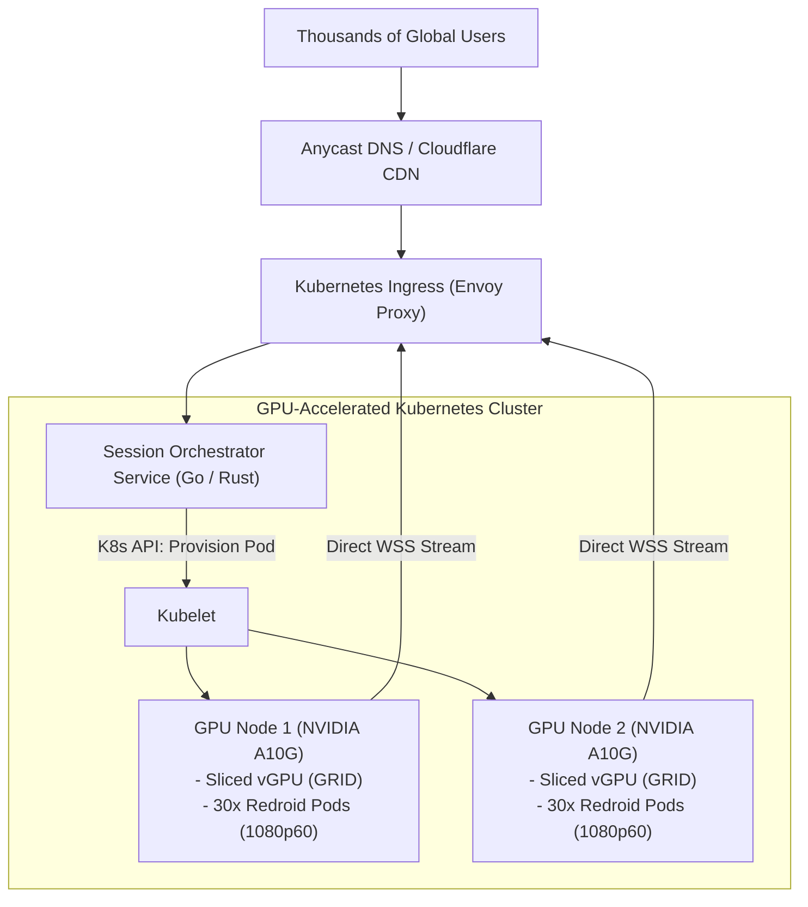

# Scaling Roadmap & Future Architecture ("With More Time")

This document outlines how the platform would evolve from an MVP into an enterprise-scale cloud virtualization service, analyzing scaling vectors, frontend evolution, and core security risks.

---

## Scaling Beyond a Few Users

While our current deployment handles 3 dedicated Redroid instances on a single Linux host, scaling to hundreds or thousands of concurrent users requires architectural changes across orchestration, encoding, and networking:

### 1. Dynamic Kubernetes Orchestration (Redroid Pods on Demand)
- **Current State**: Static pool of 3 pre-warmed Redroid containers defined in `docker-compose.yml`.
- **Production Architecture**: Implement a custom **Kubernetes Operator** (CRD: `AndroidDeviceSession`). When a user enters the waiting lobby, the operator dynamically schedules a lightweight Redroid pod within 4-6 seconds. When the user disconnects, the pod is destroyed, wiping all transient data and eliminating state leaks.

### 2. Dedicated Hardware GPU Transcoding (NVENC / QuickSync)
- **Current State**: CPU software encoding (`c2.android.avc.encoder`) sharing 2 vCPUs, dropping framerate to 10-15 FPS under 3 concurrent streams.
- **Production Architecture**: Deploy worker nodes equipped with **NVIDIA A10G or L4 GPUs** with hardware vGPU virtualization. A single GPU can encode 30+ simultaneous 1080p60 H.264 streams with sub-5ms encode times, completely eliminating CPU bottlenecks.

### 3. Adaptive Bitrate Streaming (ABR)
- **Production Architecture**: The client's `LatencyBloc` currently measures RTT and packet arrival jitter. With more time, we would feed this telemetry back to `scrcpy-server` over the control socket to dynamically modulate video bitrate (e.g., dropping from 4 Mbps to 1.5 Mbps during mobile packet loss bursts) to prevent stutter.

---

## Frontend Architecture Evolution: Pure HTML5 and TypeScript Migration

Our current frontend is implemented using Flutter Web (`flutter_bloc`, custom HTML5 Canvas platform view, and WebCodecs interop). While Flutter provides rapid UI development and clean state management, migrating to a **pure TypeScript + HTML5 WebCodecs client** offers immense benefits:

| Feature / Metric | Flutter Web Client (Current) | Pure HTML5 / TypeScript (Future) |
| :--- | :---: | :---: |
| **Initial JS/WASM Bundle Size** | ~1.8 MB | **< 35 KB (Gzipped)** |
| **Initial Time-to-Interactive (TTI)** | ~1,200 ms | **< 80 ms** |
| **DOM Interop Overhead** | PlatformView proxying | **Direct native Canvas blitting** |
| **Keyboard & Focus Handling** | FocusNode proxying | **Native DOM event listeners** |
| **Memory Footprint in Browser** | ~120 MB RAM | **< 25 MB RAM** |

Migrating the presentation layer to pure TypeScript would make the web app instantaneously responsive, eliminating Flutter canvas initialization delays on lower-end mobile browsers.

---

## Deepened Kiosk Mode: Android Enterprise DPC and Lock Task Mode

### Current Approach:
We enforce kiosk isolation via a dual-layer defense: server-side packet filtering in `ScrcpyInputAdapter` and a 3-second `dumpsys` focus watchdog that triggers `am start` if an unauthorized window appears.

### Enterprise Evolution:
With more time, we would install a custom **Device Policy Controller (DPC)** application inside the Android container with Device Owner privileges:
1. **Native Lock Task Mode (`startLockTask()`)**:
   Android's native Lock Task Mode locks the system directly at the kernel/SurfaceFlinger level. Status bar pull-down, navigation gestures, power dialogs, and multitasking are disabled by the OS itself, eliminating the need for periodic `dumpsys` polling.
2. **Package Whitelisting (`setLockTaskPackages()`)**:
   The DPC defines an immutable whitelist containing only Google Search / Browser, blocking unapproved intent launches at the OS kernel boundary.

---

## Security Risk Analysis and Mitigations

Deploying interactive remote Android instances exposed to the public internet presents critical security vectors:

### 1. Container Escape & Kernel Vulnerabilities
- **Risk**: A malicious user might attempt an Android privilege escalation (dirty COW, binder driver exploit) to break out of the Redroid container into the Linux host OS.
- **Mitigation**:
  - Run containers with unprivileged namespaces (`userns-remap`).
  - Apply strict **seccomp** profiles restricting unneeded system calls (`ptrace`, `sys_admin`).
  - Deploy **AppArmor** profiles preventing access to `/proc`, `/sys`, and host file mounts.

### 2. Lateral Network Scanning from Inside Android
- **Risk**: Android containers running on the host could attempt to port-scan the internal local network (e.g. probing AWS metadata endpoints `169.254.169.254` or local Redis/PostgreSQL ports).
- **Mitigation**: Place all Android container network interfaces in an isolated Docker bridge network with egress rules blocking private IP subnets (`10.0.0.0/8`, `172.16.0.0/12`, `192.168.0.0/16`).

### 3. Denial of Service via Malformed Binary Control Packets
- **Risk**: An attacker connecting directly to the WebSocket could flood millions of malformed touch or keycode packets to crash `scrcpy-server`.
- **Mitigation**:
  - Implement token-bucket rate limiting on the Node.js WebSocket gateway (e.g. maximum 120 input packets/second per session).
  - Enforce strict byte length boundaries before passing buffers to ADB sockets.
