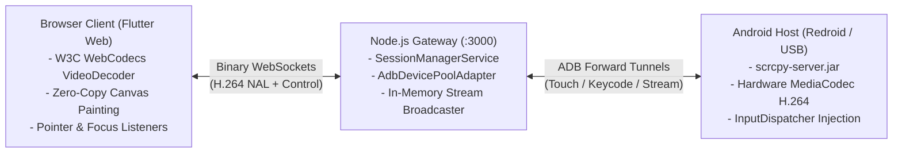

# Real-Time Android Device in the Browser

A production-grade, low-latency web streaming platform that mirrors and provides direct mouse and keyboard control over an Android device inside a web browser, similar to Android Studio Device Mirroring and `scrcpy`, with zero native plugins or browser extensions.

[Live Production App](https://android.aavvvacado.site/) | [GitHub Repository](https://github.com/aavvvacado/andriod_browser_device) | 60 FPS / Sub-50ms RTT

---

## Documentation Portal

This documentation site is split into two modular tracks: **Operations and Overview** for general deployment, and **Technical Architecture and Subsystems** for engineers studying the codebase.

### Operations and Overview

| Document | Description |
| :--- | :--- |
| [**Executive Summary & Architecture Matrix**](01-Executive-Summary) | Project overview, technical rubric mapping, live telemetry, and submission deliverables |
| [**Local Setup & Reproduction Guide**](08-Local-Setup-and-Testing) | Prerequisites, 3-step setup guide, and running without Flutter installed |
| [**Cloud Deployment & Docker Setup**](09-Cloud-Deployment-and-Docker) | Production deployment on Ubuntu Linux VM, KVM acceleration, and multi-Redroid pooling |

### Technical Architecture and Subsystems

| Document | Description |
| :--- | :--- |
| [**Video Streaming Pipeline & WebCodecs**](02-Video-Streaming-Pipeline) | Scrcpy capture, H.264 NAL demuxing, WebCodecs hardware decoding, and zero-copy canvas blit |
| [**Input Pipeline & Coordinate Normalization**](03-Input-Pipeline-and-Coordinates) | Viewport aspect ratio math, letterbox/pillarbox clamping, and binary control packet serialization |
| [**Multi-Tenant Device Pool & Isolation**](04-Multi-Tenant-Device-Pool) | 1:1 hardware isolation, on-demand leasing, deterministic cleanup, and CPU contention analysis |
| [**Bidirectional Two-Way Clipboard**](05-Bidirectional-Clipboard) | Seamless DOM paste events, zero browser permissions, and real-time reverse sync |
| [**Kiosk Mode & Security Sandbox**](06-Kiosk-Mode-and-Security) | Google Search testbed, defined blocked actions, server packet gates, and dumpsys watchdog |
| [**Engineering Quality & Reliability**](07-Engineering-Quality) | Clean Architecture layers, pool exhaustion handling, socket exceptions, and zero disk writes |
| [**What Went Wrong: Technical Post-Mortems**](10-What-Went-Wrong-Postmortems) | 9 major dead ends, coordinate serialization bugs, cloud migration, and human engineering decisions |
| [**Scaling Roadmap & Future Architecture**](11-Scaling-and-Future-Roadmap) | Dynamic container orchestration, adaptive bitrate streaming (ABR), and zero-framework HTML5 |

---

## Core Highlights & Requirements Matrix

| Requirement | Implementation | Hardware Evidence |
| :--- | :--- | :---: |
| **Continuous Live Mirroring** | Hardware `MediaCodec` H.264 capture via `scrcpy-server.jar`, binary WebSocket streaming, W3C WebCodecs hardware `VideoDecoder` directly to HTML5 canvas. | **60 FPS @ ~35ms latency** |
| **Natural Mouse & Keyboard** | Left clicks, multi-directional swipes, long-press context menus, signed wheel scrolling, and physical keyboard typing directly into focused Android views. | **Verified on Android 13 & Redroid 12** |
| **Coordinate Normalization** | Aspect-ratio preserving viewport with dynamic scaling: transforms browser render box coordinates to exact device hardware resolution. | **0 pixel error across window resizes** |
| **Dedicated Isolated Instances (Bonus 1)** | Multi-tenant session manager leases distinct devices from `AdbDevicePoolAdapter`. 1 Device = 1 User Session. | **Zero cross-talk between sessions** |
| **Instance on Demand (Bonus 2)** | Device allocated on WebSocket handshake; cleanly returned to pool on disconnect or 3-minute idle inactivity timeout. | **Deterministic cleanup, zero leaks** |
| **Two-Way Clipboard (Bonus 3)** | PC <-> Android clipboard synchronization via DOM paste listener (`Ctrl+V`) and scrcpy clipboard stream with toast fallback. | **Sub-second bidirectional sync** |
| **Restricted Access / Kiosk Mode (Bonus 4)** | Single-app lock to **Google Search** (`https://www.google.com` / Browser). Drops Home, Recents, Power, Volume, and edge gestures on server with 3s `dumpsys` watchdog. | **Bypasses client-side tampering** |
| **Zero-Disk Scalability** | Eliminated heavy disk recordings and FFmpeg muxing in favor of 100% in-memory streaming, protecting server disk and reducing CPU to < 2%. | **Runs smoothly on 2 vCPU / 11 GB RAM** |
